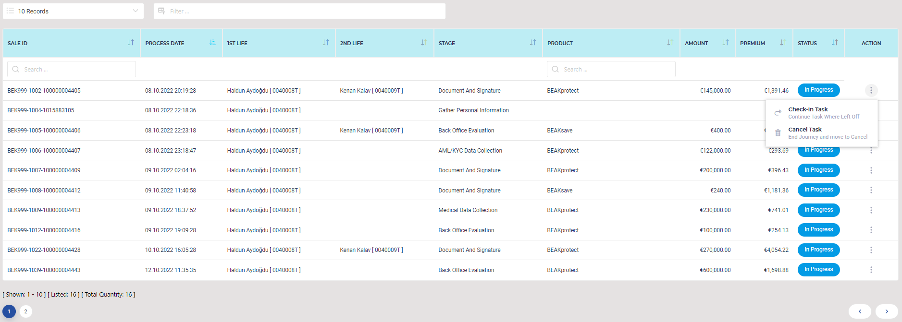

# Vue3BeakDataTable
Vue3 Datatable provided by Beakwise Inc. 

[](https://www.npmjs.com/package/vue-next-datatable)


Vue3 Beak Datatable is a Lightweight Datatable for Vue 3 by Beakwise Inc.

## Demo



## Features

- [x] Dynamically Create Columns
- [x] Dynamically Create Actions for each row 
- [x] Main Filter cover all columns defined
- [x] Sub Filter option for each column
- [x] Pagination
- [x] Sort options for each column  
- [x] Support 5 different locale of en: English, tr: Turkish, de: German, fr: French, es: Spanish

## Install

```bash
npm install --save vue3-beakdatatable
or,
yarn add vue3-beakdatatable
```

## Overview

### Simple Usage
Install to vue
```
import { createApp } from 'vue'
import Vue3BeakDataTable from 'vue3-beakdatatable'
import 'vue3-beakdatatable/dist/style.css'
const app = createApp(App)
app.component('Vue3BeakData', Vue3BeakDataTable)
app.mount('#app')
```
Add to your component
```html
<template>
   <Vue3BeakData
      :beakcolumns="columns"
      :beakrows="rowsdata"
      :beakstats="rowsdata?.length"
      :beak-action="actions"
      :is-show-line-number="false"
      :is-column-filter="true"
      :is-striped="false"
      :is-head-colored="true"
      :given-page-size="20"
      locale="en"
      sort-by-field="startdateorj"
      sort-direction="asc"
      @trigger-event="onTriggerEvent"
   />
</template>
<script>
import { ref } from 'vue'
export default {
  setup() {

    const rowsdata = [
      {
        saleid: 'BEK999-1088-100000004493',
        startdate: '19.10.2022 19:53:10',
        insured01: 'Haldun Aydoğdu [ 0040008T ]',
        insured02: '',
        stage: 'Document And Signature',
        product: 'BEAKsecure',
        amount: '€200,000.00',
        premium: '€1,029.51',
        statusText: 'In Progress',
        cjId: '0d6f8823-f54b-4c97-ab39-56c5ad6ecca2',
        psaleid: 1088,
        isQuotationCreated: true,
        ispolicyissued: false,
        startdateorj: '2022-10-19T16:53:10.294367Z',
        amountorj: 200000,
        premiumorj: 1029.51,
        isdisabled: []
      },
      {
        saleid: 'BEK999-1080-1432051349',
        startdate: '19.10.2022 11:28:21',
        insured01: 'Haldun Aydoğdu [ 0040008T ]',
        insured02: '',
        stage: 'Gather Personal Information',
        product: '',
        amount: '',
        premium: '',
        statusText: 'In Progress',
        cjId: 'de34a302-f50a-4237-8a5b-8559a20fd6ec',
        psaleid: 1080,
        isQuotationCreated: false,
        ispolicyissued: false,
        startdateorj: '2022-10-19T08:28:21.168273Z',
        amountorj: 0,
        premiumorj: 0,
        isdisabled: []
      },
    ]
  
    const columns = ref([
      {
        label: { en: 'Sale Id', tr: 'Satış No' },
        field: 'saleid',
        type: 'string',
        sortable: true,
        filterable: true,
      },
      {
        label: { en: 'Process Date', tr: 'Süreç Başlama Tarihi' },
        field: 'startdate',
        type: 'date',
        inputFormat: 'YYYY-MM-DD',
        outputFormat: 'MMM Do YY',
        sortable: true,
      },
      {
        label: { en: '1st Life', tr: '1.Sigortalı' },
        field: 'insured01',
        type: 'string',
        sortable: true,
      },
      {
        label: { en: '2nd Life', tr: '2.Sigortalı' },
        field: 'insured02',
        type: 'string',
        sortable: true,
      },
      {
        label: { en: 'Stage', tr: 'Aşama' },
        field: 'stage',
        type: 'string',
        sortable: true,
      },
      {
        label: { en: 'Product', tr: 'Ürün' },
        field: 'product',
        type: 'string',
        sortable: true,
        filterable: true,
      },
      {
        label: { en: 'Amount', tr: 'Teminat Tutarı' },
        field: 'amount',
        type: 'currency',
        sortable: true,
      },
      {
        label: { en: 'Premium', tr: 'Prim' },
        field: 'premium',
        type: 'currency',
        sortable: true,
      },
      {
        label: { en: 'Status', tr: 'Durum' },
        field: 'statusText',
        type: 'tag',
        sortable: true,
      },
    ])
  
    const actions = ref([
      {
        title: { en: 'Check-In Task', tr: 'Görev Geri Çağır' },
        subtitle: { en: 'Continue Task Where Left Off', tr: 'Göreve Devam Edin' },
        icon: 'lnir lnir-redo',
        disabled: false,
        emit: 'recallTask',
      },
      {
        title: { en: 'Cancel Task', tr: 'Görevi İptal Et' },
        subtitle: { en: 'End Journey and move to Cancel', tr: 'Ana Yolculuğu ve Görevi Sonlandır' },
        icon: 'lnir lnir-trash-can',
        disabled: false,
        emit: 'deleteTask',
      },
    ])
  
  const onTriggerEvent = (event: any) => {
    console.log('APP Level Func & Data:', event.func, event.rowdata)
  }  
  
  return {
      rowsdata,
      columns,
      actions,
      onTriggerEvent,
    }
  }
}
</script>
```

### Table Options

| Key | Type | Description | Default Value |
|---|---|---|---|
| beakcolumns | Array[ ] | Column Definition | [ ] |
| beakrows | Array[ ] | Array of Row Data to be placed on table | [ ] |
| beakstats | number | Data total row size |  |
| beak-action | ActionType[ ] | Action arrays to triggerred | [ ] |
| given-page-size | string | number of items displayed in one page | 20 |
| is-head-colored | boolean | table header color option | true |
| is-show-line-number | boolean | row number display option | false |
| is-column-filter | boolean | column wise filter option | true |
| is-striped | boolean | table stripred color option | false |
| locale | string | Language Locale | 'en' |
| sort-by-field | string | Field that the table sorted while loading | '' |
| sort-direction | string | Sort direction (asc or desc) | 'asc' |


## Contributing

To contribute you can send your request [here](mailto:info@beakwise.com)


## Contributors


## License

Vue3 Beak Datatable is open-sourced software licensed under the [GNU General Public License v3.0](LICENSE)
